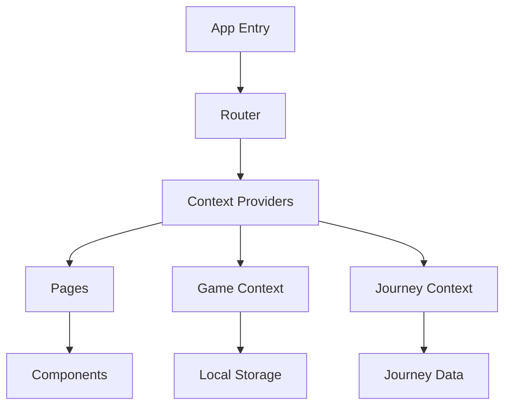
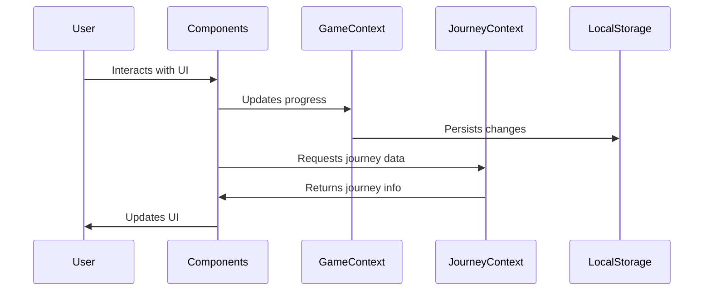
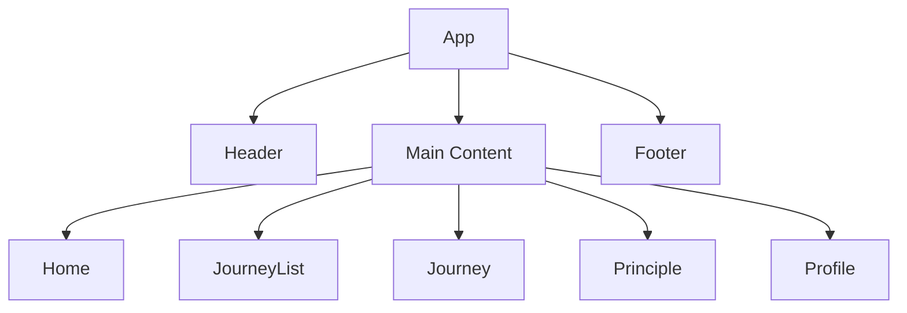
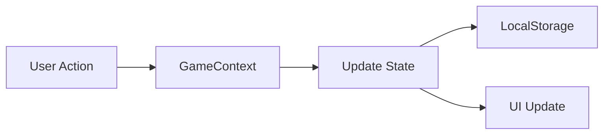
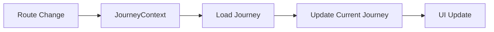
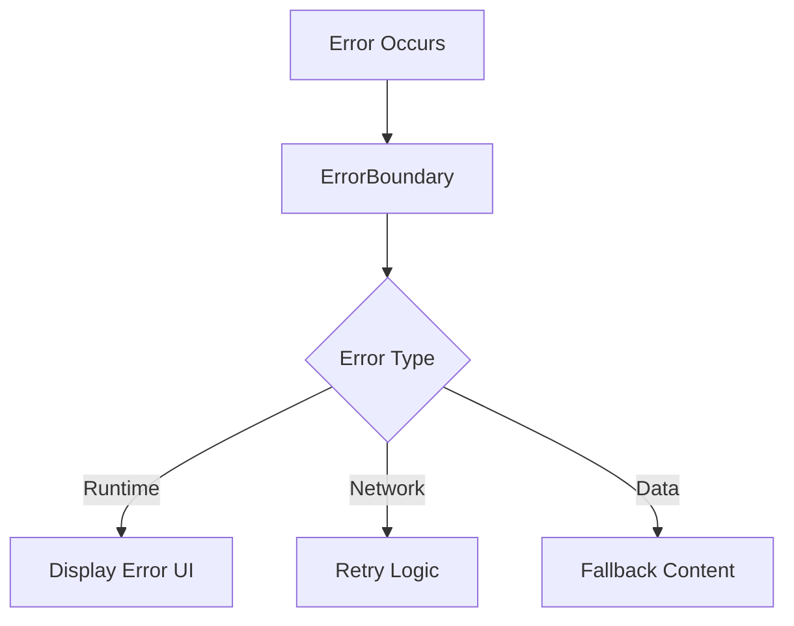
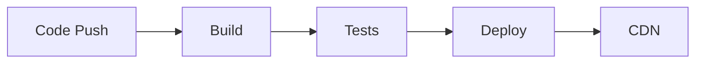

# Technical Documentation

## Architecture Overview

The application follows a modern React architecture with TypeScript, utilizing context for state management and a component-based structure. Here's a high-level overview of the system:



## Core Components

### State Management
The application uses two main context providers:

1. **GameContext**
   - Manages user progress and gamification
   - Handles points, badges, and challenge completions
   - Persists data in localStorage

2. **JourneyContext**
   - Manages current journey state
   - Provides journey data to components
   - Handles journey navigation

### Data Flow



## Directory Structure

```
src/
├── components/     # Reusable UI components
│   ├── Header.tsx
│   └── Footer.tsx
├── context/       # State management
│   ├── GameContext.tsx
│   └── JourneyContext.tsx
├── data/          # Content and data
│   └── journeys/
├── pages/         # Route components
├── types/         # TypeScript definitions
└── utils/         # Helper functions
```

## Key Features

### 1. Journey System
- Modular journey definitions
- Dynamic principle loading
- Progress tracking
- Challenge completion system

### 2. Gamification
- Points system
- Badge unlocks
- Progress tracking
- Challenge completion states

### 3. State Persistence
- LocalStorage integration
- Session management
- Progress saving

## Component Hierarchy



## Data Models

### Journey Type
```typescript
interface Journey {
  id: string;
  slug: string;
  title: string;
  description: string;
  principles: Principle[];
  author: {
    name: string;
    avatar?: string;
    bio: string;
  };
  publishedAt: string;
  category: string;
  tags: string[];
}
```

### Principle Type
```typescript
interface Principle {
  id: number;
  title: string;
  description: string;
  quote: string;
  teaching: string;
  spiritualQuote: string;
  challenges: Challenge[];
  iconName: string;
  color: string;
}
```

## State Management

### GameContext Flow


### JourneyContext Flow


## Performance Considerations

1. **Code Splitting**
   - Route-based splitting
   - Lazy loading of journeys
   - Dynamic imports

2. **State Management**
   - Context optimization
   - Memoization
   - Selective re-renders

3. **Asset Optimization**
   - Icon system using Lucide
   - Tailwind CSS purging
   - Image optimization

## Security Measures

1. **Data Protection**
   - LocalStorage encryption
   - XSS prevention
   - Input sanitization

2. **Route Protection**
   - Authentication checks
   - Route guards
   - Error boundaries

## Error Handling

The application implements a comprehensive error handling system:



## Build and Deployment

### Build Process
1. TypeScript compilation
2. Vite bundling
3. Asset optimization
4. Environment configuration

### Deployment Flow


## Testing Strategy

1. **Unit Tests**
   - Component testing
   - Context testing
   - Utility function testing

2. **Integration Tests**
   - Journey flow testing
   - State management testing
   - Route testing

## Maintenance Guidelines

1. **Adding New Journeys**
   - Create journey file in `data/journeys`
   - Follow Journey type structure
   - Add to journeys index
   - Update tests

2. **Updating Components**
   - Follow component structure
   - Maintain prop types
   - Update documentation
   - Test changes

3. **State Management**
   - Use appropriate context
   - Follow immutability patterns
   - Update persistence logic
   - Test state changes